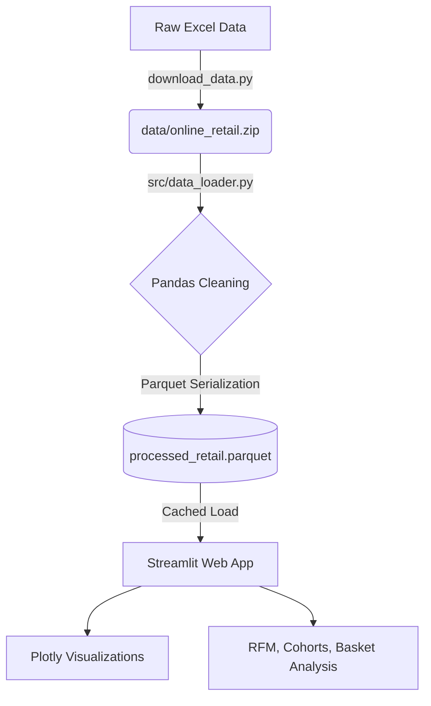

# E-Commerce Exploratory Data Analysis (EDA) Dashboard

📄 [Full EDA Report (PDF)](reports/EDA_Report.pdf)

## Project Overview & Business Value
This project is an end-to-end interactive Streamlit dashboard built to perform Exploratory Data Analysis (EDA) on a real-world e-commerce transactional dataset. 

Exploratory Data Analysis is the foundational phase of data science. This dashboard goes beyond simple aggregations by implementing advanced analytical modules that provide actionable business intelligence:
- **RFM Customer Segmentation:** Segments customers into actionable cohorts (e.g., Champions, At-Risk, Lost) based on their Recency, Frequency, and Monetary value.
- **Cohort Analysis:** Tracks monthly customer retention using a heatmap to identify drop-off points.
- **Market Basket Analysis (Cross-Selling):** Uncovers items that are frequently bought together using association rules (Apriori algorithm), enabling product recommendations and optimized store layouts.

## Architecture & Tech Stack

This project uses a modern Python data stack designed for high performance and interactivity.



- **Python** for backend logic.
- **Pandas** for robust data ingestion, cleaning, and transformation.
- **PyArrow (Parquet)** for caching processed data, resulting in 10x-20x faster read speeds compared to CSVs.
- **Plotly Express** for responsive, interactive visualizations.
- **Streamlit** for rapid web application deployment.
- **MLxtend** for generating Market Basket association rules.

## Key Insights Uncovered
1. **Customer Concentration:** The vast majority of revenue is generated by a small segment of "Champion" and "Loyal" customers (identifiable in the RFM Segmentation tab).
2. **Retention Drop-off:** Cohort analysis reveals a steep drop in customer retention after the first month, highlighting a need for stronger post-purchase engagement.
3. **Cross-Selling Opportunities:** Market basket analysis shows strong correlations between certain product categories (e.g., specific colors of alarm clocks or complementary garden items), which can be bundled for higher average order value.

## Screenshots

*(Add a few screenshots here — e.g. the KPI row, RFM treemap, and cohort retention heatmap — to give visitors a quick visual preview before they run it themselves.)*

## Setup Instructions

Follow these steps to run the dashboard locally on your machine.

### 1. Clone the repository
```bash
git clone https://github.com/charan722/ecommerce-eda-dashboard.git
cd ecommerce-eda-dashboard
```

### 2. Install Dependencies
It's recommended to use a virtual environment.
```bash
pip install -r requirements.txt
```

### 3. Run the Dashboard
A pre-processed dataset (`data/processed_retail.parquet`) is already included in the repo, so you can launch the dashboard directly:
```bash
streamlit run app.py
```
The application will open automatically in your browser at `http://localhost:8501`.

### (Optional) Rebuild the dataset from scratch
If you'd like to re-download and re-process the raw data yourself instead of using the included Parquet cache:
```bash
# Download the raw dataset from the UCI Machine Learning Repository
python download_data.py

# Clean, transform, and re-cache to Parquet
python -m src.data_loader
```
