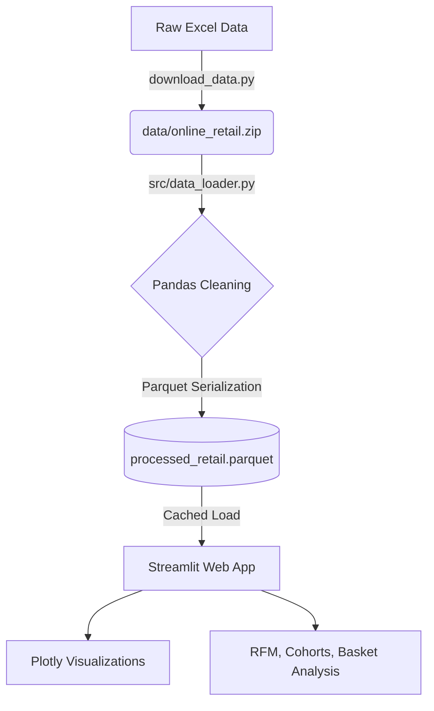

# Customer Retention & Cross-Sell Analysis for an Online Retail Business (2010–2011)

🚀 **[Live Dashboard](https://ecommerce-eda-dashboard-v2daalqnwktr6wsvt6cegg.streamlit.app/)** &nbsp;|&nbsp; 📄 [Full EDA Report (PDF)](reports/EDA_Report.pdf)

An interactive Streamlit dashboard that turns a raw UK online-retail transaction log into three decision-ready analyses: which customers are worth retaining, where retention breaks down, and which products should be bundled together.

---

## 1. Business Problem

Most EDA portfolio projects stop at descriptive charts — total sales by month, top products, that kind of thing. Those are useful, but they don't answer the questions a retail business actually needs answered to act:

- **Which customers matter most, and which are slipping away?** Revenue is rarely distributed evenly across a customer base, and treating every customer the same wastes retention budget.
- **When do new customers stop coming back, and how badly?** If there's a sharp drop-off after the first purchase, that's a signal to fix onboarding or post-purchase engagement, not just to "run more marketing."
- **What products get bought together?** Knowing this drives store layout, bundling, and product recommendations — all direct levers on average order value.

This project was built to answer those three questions specifically, using **RFM segmentation**, **cohort retention analysis**, and **market basket analysis** — the same techniques a retail analytics team would reach for — rather than stopping at surface-level aggregation.

---

## 2. Data Description

- **Source:** [UCI Machine Learning Repository — Online Retail dataset](https://archive.ics.uci.edu/dataset/352/online+retail), a transactional log of a UK-based, non-store online retailer selling all-occasion gifts, covering **01/12/2010 to 09/12/2011**. Many of the retailer's customers are wholesalers, which shapes some of the purchasing patterns seen in the data.
- **Format:** Raw Excel file (`Online Retail.xlsx`), ingested and cached as Parquet for 10–20x faster reload performance in the dashboard.
- **Cleaning steps applied** (`src/data_loader.py`):
  - Removed exact duplicate rows.
  - Flagged and excluded cancelled orders (`InvoiceNo` starting with `"C"`) from primary sales analytics.
  - Filtered out invalid records — negative/zero quantities and zero unit prices.
  - Standardized product descriptions (trimmed, upper-cased, missing values relabeled `"UNKNOWN ITEM"`).
  - Imputed missing `CustomerID`s to `-1` rather than dropping rows, so guest/unregistered transactions stay visible in revenue totals instead of silently disappearing.
- **Engineered fields:** `TotalAmount` (Quantity × UnitPrice), plus `YearMonth`, `Hour`, and `DayOfWeek` breakdowns from the invoice timestamp to support time-based analysis.

---

## 3. Results & Analysis

### Architecture



**Tech stack:** Pandas for ingestion and transformation · PyArrow/Parquet for caching · Plotly Express for interactive visuals · Streamlit for the web app, deployed on Streamlit Community Cloud · MLxtend for market basket association rules.

### RFM Customer Segmentation
Customers are scored on **R**ecency, **F**requency, and **M**onetary value and grouped into actionable cohorts (Champions, Loyal, At-Risk, Lost, etc.), rather than treated as a single undifferentiated pool.

**Finding:** Revenue is heavily concentrated — a relatively small segment of "Champion" and "Loyal" customers accounts for the majority of total revenue, which means retention efforts are far more valuable when targeted at this segment specifically rather than spread evenly across the customer base.

### Cohort Retention Analysis
Customers are grouped by the month of their first purchase and tracked forward, visualized as a retention heatmap to spot exactly where drop-off happens.

**Finding:** Retention drops sharply after the first month across nearly every cohort — pointing to a gap in post-purchase engagement (e.g., no meaningful follow-up after a customer's first order) rather than a demand problem.

### Market Basket Analysis (Cross-Selling)
Using the Apriori algorithm to mine association rules across transactions, surfacing which products are frequently purchased together.

**Finding:** Clear co-purchase patterns emerge — for example, specific colorways of the same item (alarm clocks) and complementary product sets (garden items) — that translate directly into bundling and recommendation opportunities to lift average order value.

### Screenshots
*Add screenshots of the KPI row, RFM treemap, and cohort retention heatmap here — a visitor should be able to see what the dashboard looks like before running it themselves.*

---

## 4. Next Steps & Limitations

**Current limitations:**
- The dataset covers a single retailer over roughly a 12-month window, so seasonal patterns beyond one year (e.g., year-over-year holiday trends) can't be assessed.
- `CustomerID` is missing for a meaningful share of transactions (imputed to `-1`), so RFM segmentation only reflects identifiable, registered customers — guest checkouts are excluded from that specific analysis even though they're kept in overall revenue figures.
- Market basket rules are correlational, not causal — they show what's *bought together*, not *why*, so bundling decisions built on them should still be validated with A/B tests before rolling out broadly.

**Recommended next steps:**
- Extend the RFM segmentation into a **predictive churn model** so at-risk customers can be flagged before they lapse, not just after.
- Add **cohort analysis by acquisition channel** (if that data becomes available) to see whether retention differs by how a customer was acquired.
- Turn top market-basket rules into an actual **on-site recommendation module** and measure lift against a control group.

---

## Repository Structure

```
ecommerce-eda-dashboard/
├── app.py                          # Streamlit dashboard app
├── download_data.py                # Downloads raw dataset from UCI repository
├── src/
│   └── data_loader.py              # Cleaning, transformation, Parquet caching
├── data/
│   └── processed_retail.parquet    # Pre-processed dataset (included)
├── test_analytics.py
├── requirements.txt
└── README.md
```

## Setup Instructions

### 1. Clone the repository
```bash
git clone https://github.com/charan722/ecommerce-eda-dashboard.git
cd ecommerce-eda-dashboard
```

### 2. Install dependencies
```bash
pip install -r requirements.txt
```

### 3. Run the dashboard
A pre-processed dataset (`data/processed_retail.parquet`) is already included, so you can launch directly:
```bash
streamlit run app.py
```
The app opens automatically at `http://localhost:8501`.

### (Optional) Rebuild the dataset from scratch
```bash
# Download the raw dataset from the UCI Machine Learning Repository
python download_data.py

# Clean, transform, and re-cache to Parquet
python -m src.data_loader
```

---

**Topics:** `data-science` `eda` `rfm-segmentation` `cohort-analysis` `market-basket-analysis` `streamlit` `plotly`
